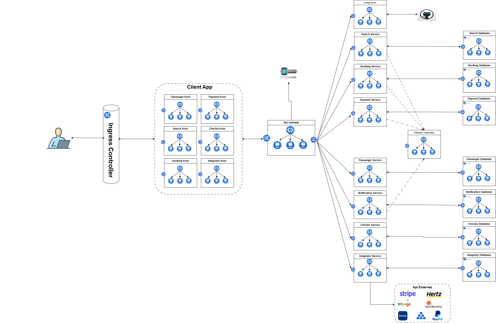
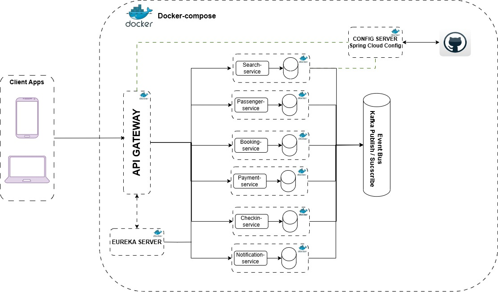

# ✈️ FlyReserver

FlyReserver est une application de réservation de vols construite selon une architecture **microservices** avec Spring Boot, Eureka, API Gateway et Spring Cloud Config.


## 📚 Description du projet

L'application permet :
- La recherche de vols
- La réservation de vols
- Le paiement des billets
- La génération et envoi du billet au passager
- La gestion des passagers et du check-in

Chaque fonctionnalité est implémentée dans un microservice **indépendant** communiquant via **REST** et **Feign Clients**.

---

## ⚙️ Architecture Poc 


### 🧩 Microservices :

| Service              | Port  | Description                                 |
|----------------------|-------|---------------------------------------------|
| `api-gateway`        | 8080  | Point d’entrée unique vers tous les services |
| `eureka-server`      | 8761  | Service de découverte                        |
| `config-server`      | 9090  | Fournit la configuration centralisée        |
| `search-service`     | 8081  | Recherche de vols                            |
| `booking-service`    | 8082  | Gestion des réservations                     |
| `payment-service`    | 8083  | Paiement en ligne                            |
| `notification-service` | 8084| Envoi des e-mails et des billets             |
| `passenger-service`  | 8085  | Gestion des passagers                        |
| `checkin-service`    | 8086  | Enregistrement (check-in)                    |

---

## 🛠️ Technologies utilisées

- Java 17 / Spring Boot 3.x
- Spring Cloud (Eureka, Config, OpenFeign)
- Spring Data JPA + H2 (in-memory DB pour dev)
- Lombok
- Docker (optionnel)
- Maven

---

## 🚀 Démarrage rapide

### Prérequis

- Java 17
- Maven 3.8+
- Postman / Insomnia (pour tester l’API)
- (Optionnel) Docker et Docker Compose

### Étapes
1. **Démarrer `Kafka`**
```bash

.\bin\windows\zookeeper-server-start.bat .\config\zookeeper.properties

# Dans un autre terminal exécute la commande suivante 

.\bin\windows\kafka-server-start.bat .\config\server.properties

```
2. **Démarrer `config-server`**
2. **Démarrer `eureka-server`**
3. **Démarrer tous les microservices**
4. **Lancer `api-gateway`**
5. Accéder aux services via : `http://localhost:8080/service-name/`

---
